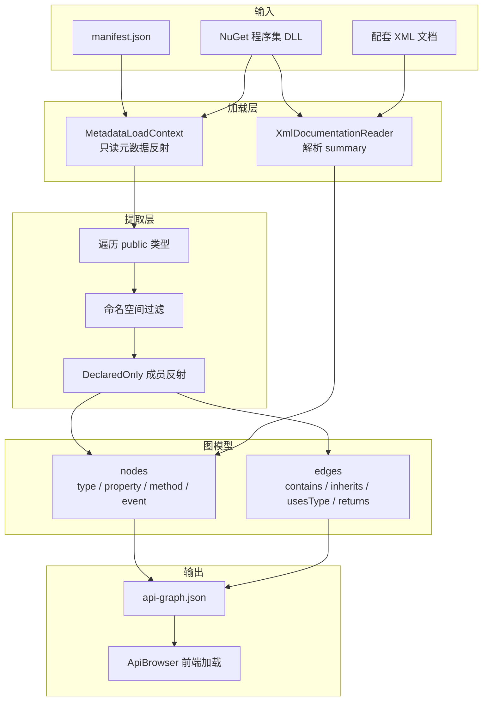
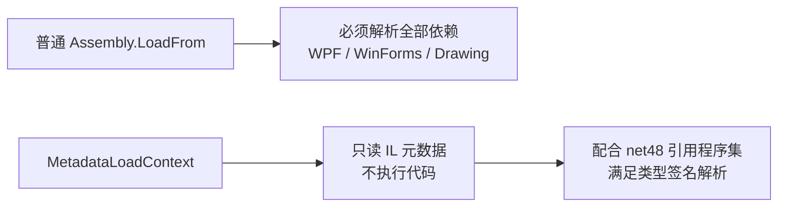
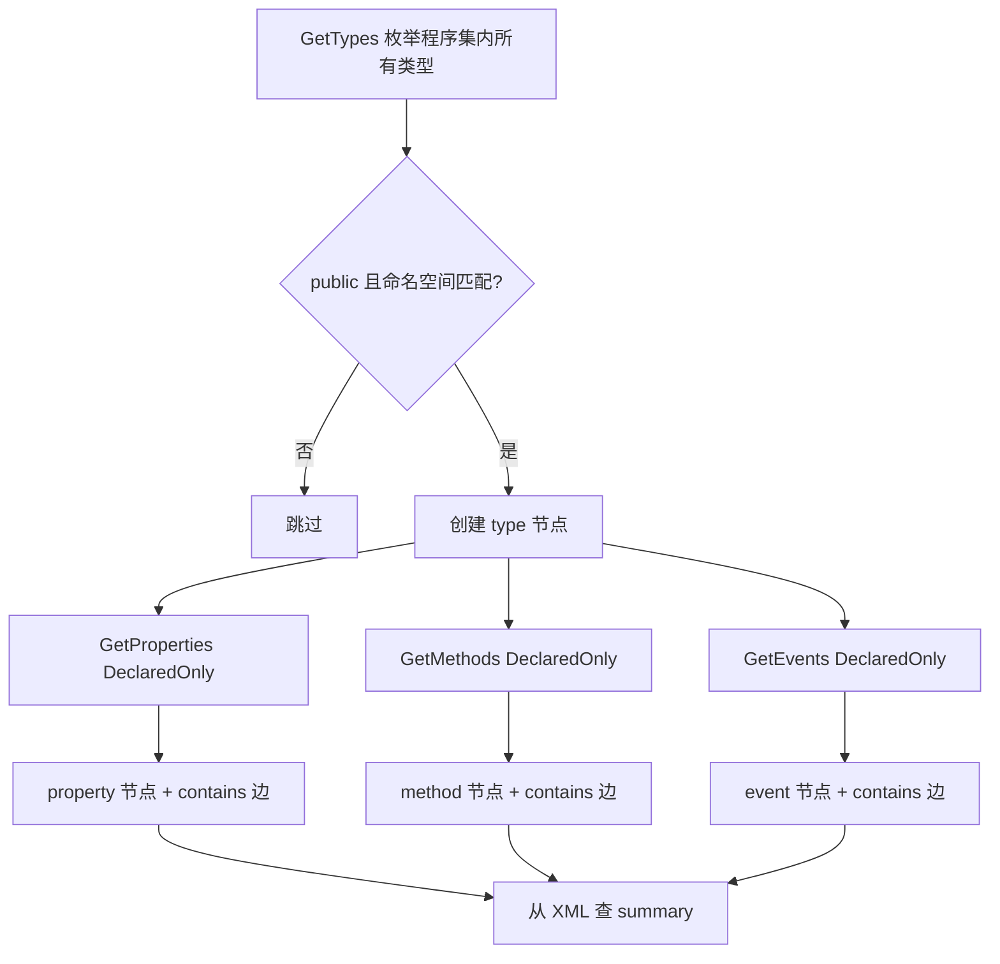
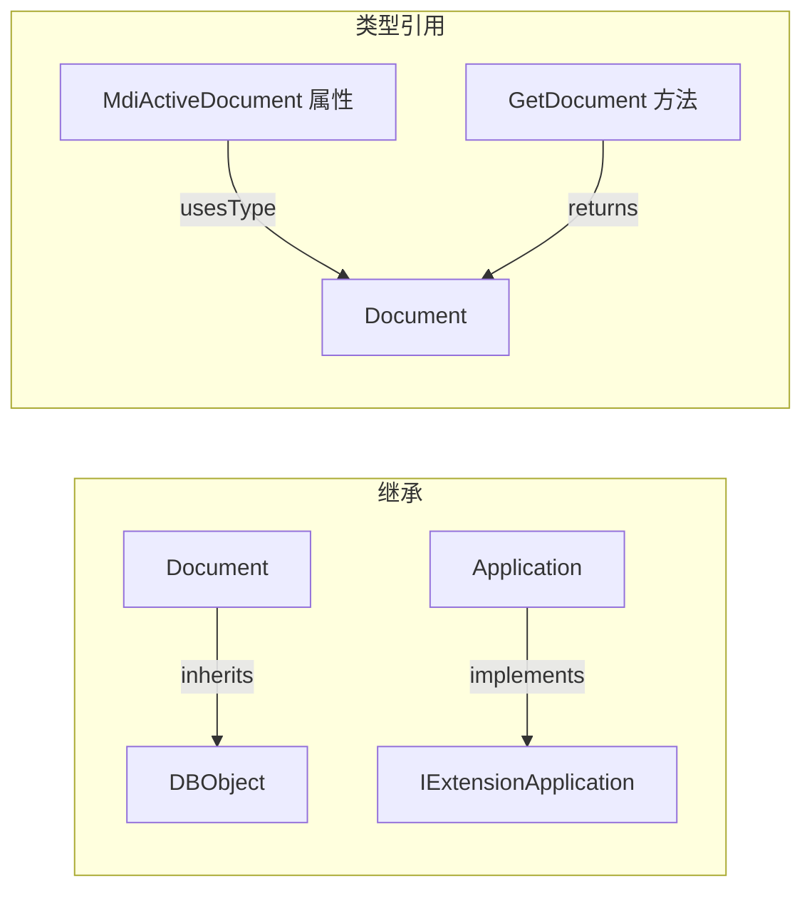
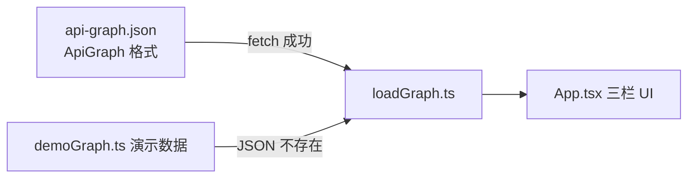
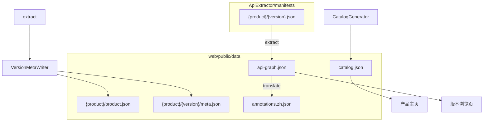

# ApiExtractor 提取原理

## 总体流程



## 数据来源

| 来源 | 路径示例 | 提供的信息 |
|------|----------|------------|
| `AcCoreMgd.dll` | AutoCAD.NET.Core 24.0.0 | 核心 API 类型结构 |
| `AcDbMgd.dll` | AutoCAD.NET.Model 24.0.0 | DatabaseServices 等大量类型 |
| `AcMgd.dll` | AutoCAD.NET 24.0.0 | ApplicationServices、Windows 等 |
| `AcMgd.xml` 等 | 与 DLL 同目录 | 英文 `<summary>` 说明 |

**不依赖 AutoCAD 进程**：工具在构建时离线运行，只读取 NuGet 包里的 DLL + XML。

## MetadataLoadContext 的作用



AutoCAD .NET 程序集引用 `PresentationCore`、`System.Drawing` 等。若用常规反射加载，在纯控制台环境容易因缺少 WPF 运行时失败。

`MetadataLoadContext` 在隔离上下文中**只读取类型元数据**（名称、基类、成员签名），不真正实例化 AutoCAD 对象，因此无需启动 AutoCAD。

## 单类型提取步骤



- **DeclaredOnly**：只取类型**自身声明**的成员，不包含从基类继承的成员（避免重复）。
- **命名空间过滤**：`manifest.json` 中 `namespacePrefixes: ["Autodesk.AutoCAD."]` 决定收录范围。

## 关系边（第二遍补全）



| 边类型 | 含义 | 生成方式 |
|--------|------|----------|
| `contains` | 类包含成员 | 提取成员时：`类型 → 属性/方法/事件` |
| `inherits` | 继承 | 第二遍：`type.BaseType` |
| `implements` | 实现接口 | 第二遍：`type.GetInterfaces()` |
| `usesType` | 属性类型引用 | 属性 `propertyType` 匹配已收录类型名 |
| `returns` | 方法返回类型引用 | 方法 `returnType` 匹配已收录类型名 |

## XML 文档匹配

XML 中成员 ID 遵循 .NET 文档规范，例如：

```
T:Autodesk.AutoCAD.ApplicationServices.Application     → 类型
P:Autodesk.AutoCAD.ApplicationServices.Application.DocumentManager → 属性
M:Autodesk.AutoCAD.ApplicationServices.Application.ShowModalWindow(System.Windows.Window) → 方法
```

工具按反射得到的 `MemberInfo` 构造相同 ID，在 XML 字典中查找 `<summary>` 文本。

Autodesk 的 XML 偶有格式错误，解析失败时自动降级为正则提取。

## 输出与前端



JSON 结构与 `web/src/types/api.ts` 中的 `ApiGraph` 一致，前端直接用于左侧命名空间树、中间成员列表、右侧详情面板。

## 多产品目录与 catalog



| 命令 | 默认路径 |
|------|----------|
| `extract --product autocad --version 2021` | `data/autocad/2021/api-graph.json` |
| `translate`（同上） | 读 graph，写 `annotations.zh.json` |
| `scan-catalog` | 扫描 `data/` 生成 `catalog.json` |

extract / translate 完成后自动调用 `CatalogGenerator` 刷新索引。
