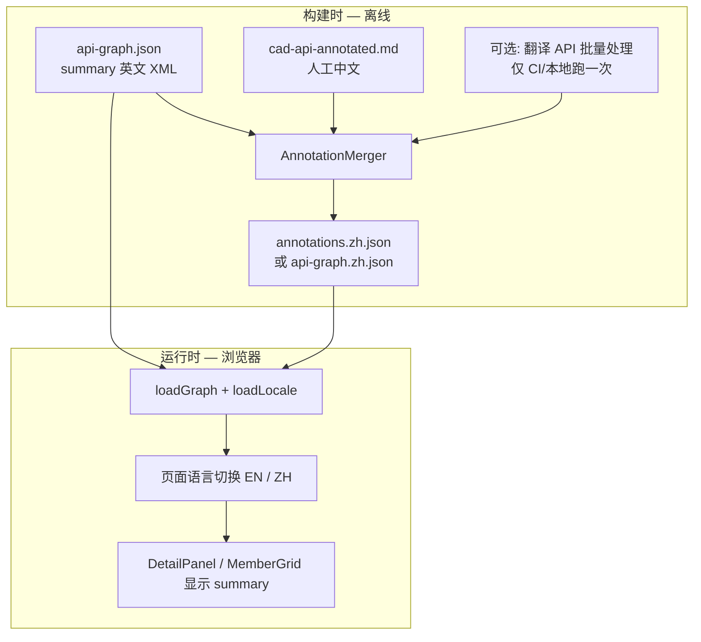
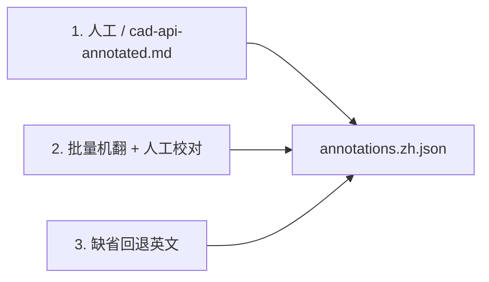

# ApiBrowser 中英文说明方案

## 推荐结论

**不需要在页面上接实时翻译 API。**  
静态站点应在**构建阶段**生成中文数据，前端只做「中 / 英」切换显示。



## 数据模型（建议）

```mermaid
classDiagram
    class ApiNode {
        +string id
        +string name
        +string fullName
        +string summaryEn
        +string summaryZh
        +string summary
    }

    note for ApiNode
        summary = 当前语言下的有效说明
        或由 getSummary(node, locale) 计算
    end
```

两种落地方式（二选一）：

| 方案 | 文件 | 优点 |
|------|------|------|
| **A. 覆盖层（推荐）** | `api-graph.json` + `annotations.zh.json` | 英文可随 ApiExtractor 随时重生成，中文不被覆盖 |
| **B. 双文件** | `api-graph.en.json` + `api-graph.zh.json` | 结构简单，但重复体积大 |

覆盖层键名建议用 **`fullName`**（如 `Autodesk.AutoCAD.ApplicationServices.Application.DocumentManager`），比 `id` 更稳定。

```json
{
  "Autodesk.AutoCAD.ApplicationServices.Application.DocumentManager": {
    "summary": "管理所有打开的 Document；插件最常用的入口属性。"
  }
}
```

## 翻译来源优先级



1. **人工 + 现有 Markdown**（质量最高）  
   - 仓库已有 `.cursor/skills/acad-plugin-dev/cad-api-annotated.md`  
   - 写 `MarkdownAnnotationImporter` 解析表格「成员 | 说明」  
   - 覆盖常用 API（Runtime、ApplicationServices、EditorInput、DatabaseServices）

2. **批量机翻**（补全长尾，约 1.3 万条）  
   - 在 **ApiExtractor 之后** 跑 `AnnotationTranslator`  
   - 只翻译「尚无中文」的条目  
   - 结果入库 JSON，可分批 PR 校对

3. **缺省回退**  
   - 无中文时显示英文 `summary`，UI 可标注「暂无中文说明」

## 是否需要你提供翻译接口？

| 场景 | 是否需要接口 |
|------|----------------|
| 页面切换中/英显示 | **否** |
| 用 cad-api-annotated.md 填常用 API | **否** |
| 全量 1.3 万条自动机翻 | **可选**（构建脚本用，非浏览器用） |
| 用户在浏览器里点「翻译此页」 | **是**（不推荐） |

若提供接口，建议用法：

```
dotnet run --project AnnotationTranslator -- \
  --input  web/public/data/api-graph.json \
  --output web/public/data/annotations.zh.json \
  --provider deepseek|deepl|azure \
  --api-key  $ENV_KEY \
  --batch-size 50 \
  --skip-existing
```

- 密钥放在**环境变量 / CI Secret**，不进仓库  
- **限速 + 断点续传**（按 fullName 跳过已有翻译）  
- 全量跑一次可能需要数小时，适合离线批处理，不适合 dev 热更新

## 页面切换（前端）

```mermaid
flowchart LR
    USER[用户点击 中文 / English]
    STATE[locale: zh | en]
    RESOLVE["getSummary(node):
    zh ? summaryZh ?? summaryEn
    : summaryEn"]
    USER --> STATE --> RESOLVE
```

- 状态：`useState<'zh'|'en'>` 或 `localStorage` 记住偏好  
- 位置：顶栏或右侧面板标题旁  
- 列视图双行说明、DetailPanel 的 summary 共用同一 `getSummary()`

## 推荐实施顺序

1. 扩展 `ApiNode` / 加载逻辑，支持 `summaryEn` + 覆盖层 merge  
2. 前端加 **中 / EN** 切换  
3. `MarkdownAnnotationImporter` ← cad-api-annotated.md（常用 API 立刻有中文）  
4. （可选）你提供翻译 API → `AnnotationTranslator` 批量补全  
5. 人工校对高频类型（Application、Document、Database、Editor、Transaction）
